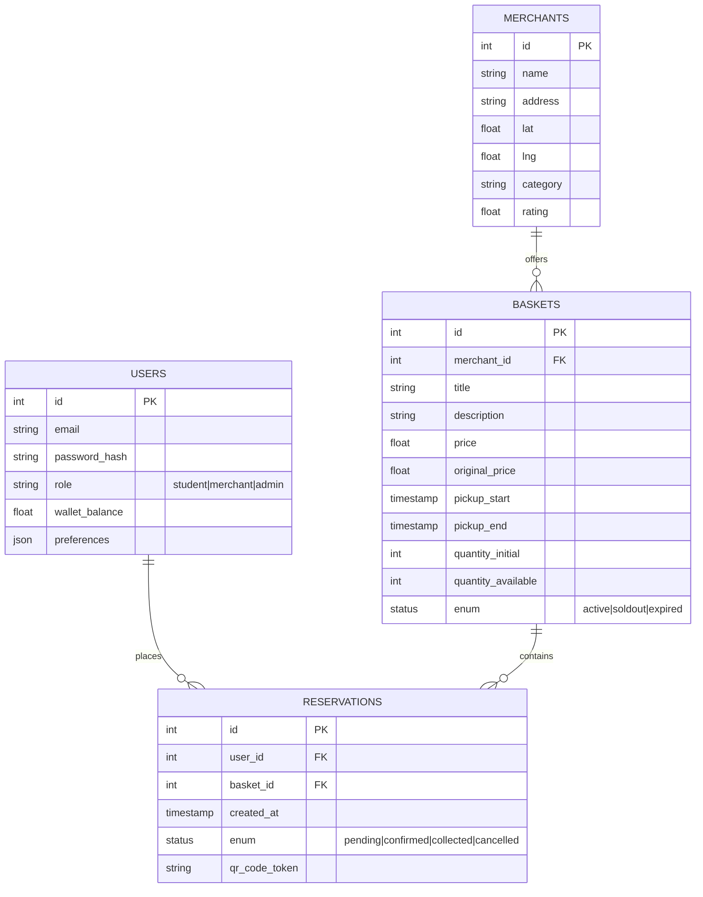

# Dossier Technique Complet - JustEcoBox

Ce document détaille l'architecture technique, l'API, le modèle de données et la vision Data/IA de la solution JustEcoBox.

## 1. Architecture Technique

### Schéma Global de la Solution

```mermaid
graph TD
    subgraph "Frontend (Clients)"
        WebApp[WebApp (HTML/JS/PWA)]
        Mobile[App Mobile (React Native)]
    end

    subgraph "Backend System"
        API_GW[API Gateway (Node.js/Express)]
        Auth_Svc[Service d'Auth (JWT)]
        Core_App[Core Application (Business Logic)]
        AI_Engine[Moteur IA (Python/TensorFlow)]
    end

    subgraph "Data Layer"
        DB[(PostgreSQL - Données Relationnelles)]
        Cache[(Redis - Cache & Sessions)]
        ObjStorage[S3 - Stockage Images]
    end

    subgraph "External Services"
        Stripe[Stripe (Paiement)]
        Maps[Google Maps API (Géolocalisation)]
        Notif[Firebase FCM (Notifications Push)]
    end

    WebApp -->|HTTPS/REST| API_GW
    Mobile -->|HTTPS/REST| API_GW
    
    API_GW --> Auth_Svc
    API_GW --> Core_App
    
    Core_App --> DB
    Core_App --> Cache
    Core_App --> ObjStorage
    Core_App --> AI_Engine
    
    API_GW --> Stripe
    API_GW --> Notif
    WebApp --> Maps
    
    AI_Engine -.->|Lecture Historique| DB
```

### Description des Composants
*   **Frontend** : Application Web Progressive (PWA) pour une accessibilité maximale et Application Mobile native pour les notifications et la fidélisation.
*   **Backend** : Architecture micro-services ou monolithique modulaire (Node.js) exposant une API RESTful.
*   **Base de Données** : PostgreSQL pour la robustesse des données transactionnelles (commandes, stocks).
*   **Services Externes** : Intégration de solutions éprouvées pour le paiement et la cartographie.

---

## 2. Documentation API (Simplifiée)

Voici les principaux endpoints de l'API REST JustEcoBox.

### Authentification

#### `POST /api/v1/auth/login`
Authentifie un utilisateur et retourne un token JWT.
*   **Body** : `{ "email": "user@example.com", "password": "***" }`
*   **Réponse (200)** :
    ```json
    {
      "token": "eyJhbGciOiJIUzI1...",
      "user": { "id": 1, "role": "student", "name": "Jean" }
    }
    ```

### Paniers (Baskets)

#### `GET /api/v1/baskets`
Récupère la liste des paniers disponibles avec filtres.
*   **Paramètres** : `lat` (float), `lng` (float), `radius` (km), `category` (string)
*   **Réponse (200)** :
    ```json
    [
      {
        "id": 101,
        "title": "Panier Fraîcheur",
        "price": 4.99,
        "originalPrice": 12.00,
        "merchant": { "id": 5, "name": "Boulangerie Ange" },
        "distance": "500m"
      }
    ]
    ```

#### `GET /api/v1/baskets/{id}`
Détails complets d'un panier.
*   **Réponse (200)** : `{ "id": 101, "items": ["Pain", "Croissants"], "pickupTime": "18:00-19:00" }`
*   **Erreur (404)** : `{ "code": "BASKET_NOT_FOUND", "message": "Panier introuvable" }`

### Réservations

#### `POST /api/v1/reservations`
Crée une réservation pour un panier.
*   **Body** : `{ "basketId": 101, "paymentMethod": "stripe" }`
*   **Réponse (201)** :
    ```json
    {
      "reservationId": "RES-8854",
      "status": "confirmed",
      "qrCodeUrl": "https://api.justecobox.com/qr/RES-8854.png"
    }
    ```

### Profil Utilisateur

#### `GET /api/v1/user/profile`
Récupère les infos et statistiques de l'utilisateur connecté.
*   **Header** : `Authorization: Bearer <token>`
*   **Réponse (200)** :
    ```json
    {
      "id": 1,
      "savings": 154.50,
      "basketsSaved": 12,
      "co2Avoided": 35.5
    }
    ```

---

## 3. Schéma de Base de Données

Modèle de données relationnel simplifié (MCD).



### Description des Tables
*   **USERS** : Stocke les informations de connexion, les préférences alimentaires et le solde.
*   **MERCHANTS** : Commerçants partenaires avec leur géolocalisation pour la carte.
*   **BASKETS** : Les offres disponibles. Un panier a un stock (`quantity`) et un créneau de retrait.
*   **RESERVATIONS** : Table de liaison transactionnelle. Une réservation lie un utilisateur à un panier et génère le QR Code (token) pour le retrait.

### Modèle Logique de Données (MLD)
*   **USERS** (#id, email, password_hash, role, wallet_balance, preferences)
*   **MERCHANTS** (#id, name, address, lat, lng, category, rating)
*   **BASKETS** (#id, #merchant_id=>MERCHANTS, title, description, price, original_price, pickup_window, quantity, status)
*   **RESERVATIONS** (#id, #user_id=>USERS, #basket_id=>BASKETS, created_at, status, qr_code_token)

---

## 4. Vision Data & IA

L'intelligence artificielle est au cœur de JustEcoBox pour optimiser la lutte anti-gaspillage.

### Collecte de Données
*   **Comportementales** : Historique d'achats, paniers consultés mais non achetés, heures de connexion.
*   **Contextuelles** : Géolocalisation, météo (impact sur les invendus), calendrier (vacances, jours fériés).
*   **Marchandes** : Types d'invendus récurrents, volumes par jour de la semaine.

### Cas d'Usage IA

#### 1. Recommandation Hyper-Personnalisée (Pour l'Étudiant)
*   **Algorithme** : Collaborative Filtering & Content-Based Filtering.
*   **Fonction** : Suggérer des paniers basés sur les goûts passés et la proximité.
*   **Valeur** : "Ne cherchez plus, voici ce que vous aimez à -50% juste à côté."

#### 2. Prédiction de Stock & Pricing Dynamique (Pour le Commerçant)
*   **Algorithme** : Time Series Forecasting (Prophet/LSTM).
*   **Fonction** : Prédire la quantité d'invendus du jour et suggérer le prix optimal pour tout écouler avant la fermeture.
*   **Valeur** : Maximisation des revenus et zéro déchet garanti.

#### 3. Assistant Intelligent "JEB" (NLP/LLM)
*   **Technologie** : Large Language Model (type GPT optimisé).
*   **Fonction** : Chatbot interactif capable de répondre aux questions sur l'impact écologique, ou de proposer des recettes avec les ingrédients du panier du jour.

### Respect RGPD & Éthique
### Respect RGPD & Éthique
*   **Privacy by Design** : Toutes les données personnelles sont chiffrées.
*   **Consentement** : Opt-in explicite pour la géolocalisation et l'analyse comportementale.
*   **Droit à l'oubli** : Suppression complète des données utilisateur sur simple demande via l'app.
*   **Anonymisation** : Les données utilisées pour l'entraînement des modèles IA sont anonymisées.

---

## 5. Sécurité & Conformité RGPD (Détails)

### 🔒 Conformité RGPD (Règlement Général sur la Protection des Données)

#### 1. Données Personnelles Identifiées
Nous ne collectons que le strict nécessaire (Minimisation) :
*   **Identité** : Nom, Prénom, Email (Nécessaire pour le contrat).
*   **Localisation** : Position GPS (Uniquement lors de la recherche, non stockée sans consentement).
*   **Paiement** : Token Stripe uniquement (Aucune donnée bancaire stockée sur nos serveurs).

#### 2. Base Légale
*   **Exécution du contrat** : Pour la réservation et le retrait des paniers.
*   **Consentement** : Pour les cookies analytics et la géolocalisation précise.
*   **Intérêt légitime** : Pour la lutte contre la fraude et la sécurité du compte.

#### 3. Droits Utilisateurs (User Control)
Accessible directement depuis l'application (Profile > Settings) :
*   **Droit d'accès** : Télécharger toutes ses données au format JSON.
*   **Droit à l'oubli** : Bouton "Supprimer mon compte" (Soft delete 30 jours, puis Hard delete).
*   **Droit de rectification** : Modification immédiate du profil.

### 🔒 Sécurité Technique

#### Authentification & Sessions
*   **JWT (JSON Web Tokens)** : Stateless, avec expiration courte (1h) et Refresh Token sécurisé (HttpOnly cookie).
*   **Hashage** : Mots de passe hashés avec **Argon2id** (Standard OWASP).
*   **Rate Limiting** : Protection contre le Brute Force sur `/login`.

#### Chiffrement
*   **Au repos (At rest)** : Base de données chiffrée (AES-256).
*   **En transit (In transit)** : HTTPS/TLS 1.3 forcé pour toutes les communications (HSTS activé).

#### Privacy by Design (IA)
*   Les modèles de prédiction IA n'utilisent aucune donnée identifiante.
*   Les historiques sont agrégés par zones géographiques floues avant analyse.

---

## 6. Guide de Déploiement

### Stratégie CI/CD
*   **Source** : GitHub (Gestion de versions).
*   **Hébergement Frontend** : Netlify (Pour la PWA/SPA).
*   **Hébergement Backend** : Railway ou Heroku (Pour l'API Node.js).
*   **Base de Données** : Supabase ou ElephantSQL (PostgreSQL managé).

### Étapes de Déploiement

#### A. GitHub (Version Control)
1.  Initialiser le dépôt : `git init`.
2.  Créer le `.gitignore` (exclure `node_modules`, `.env`).
3.  Commit initial : `git add . && git commit -m "Initial commit"`.
4.  Push vers GitHub : `git push origin main`.

#### B. Netlify (Frontend Hosting)
1.  Connecter Netlify au dépôt GitHub.
2.  **Build Command** : `npm run build` (si React/Vue) ou laisser vide pour du statique.
3.  **Publish Directory** : `dist` (ou racine `/` pour notre prototype actuel).
4.  **Déploiement automatique** : À chaque `git push`, Netlify redéploie une nouvelle version.
5.  **HTTPS** : Activé automatiquement avec un certificat Let's Encrypt.

#### C. Variables d'Environnement
Ne jamais commiter les clés API. Configurer dans Netlify/Heroku :
*   `STRIPE_PUBLIC_KEY`
*   `GOOGLE_MAPS_KEY`
*   `API_URL` (L'URL de votre backend prod)
