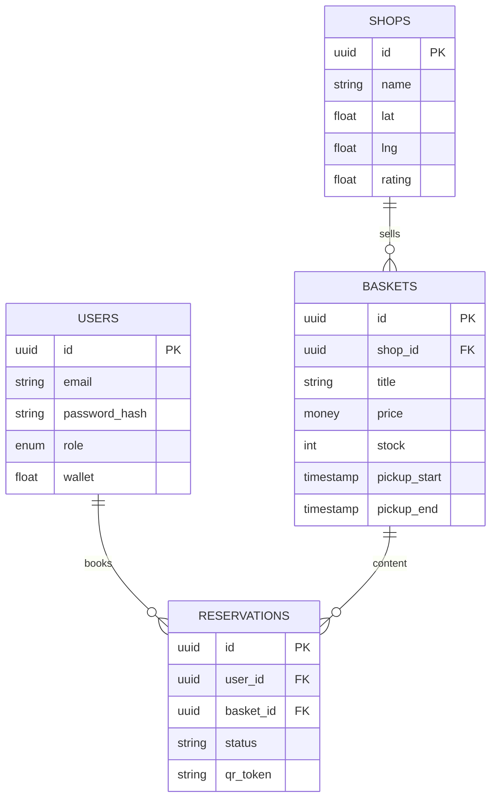

# FICHE_TECH : Dossier Technique Complet & Pitch Deck - JustEcoBox

Ce document constitue le livrable final technique et stratégique pour le projet JustEcoBox. Il regroupe l'architecture, la documentation technique, la sécurité, ainsi que le support de présentation (Pitch Deck).

---

# 🏗️ PARTIE 1 : ARCHITECTURE TECHNIQUE COMPLÈTE

## 1. Vue d'ensemble et Stack Technologique

### Schéma d'Architecture Global
```mermaid
graph TD
    subgraph "Frontend (Mobile First)"
        Mobile[App Mobile (React Native)]
        WebApp[WebApp PWA (React.js)]
    end

    subgraph "Backend API"
        API[API Gateway (Node.js / Express)]
        Auth[Service Authentification (JWT)]
        Core[Core Engine (Gestion Paniers)]
    end

    subgraph "Data & Storage"
        DB[(PostgreSQL)]
        Redis[(Redis Cache)]
        S3[Stockage Images]
    end

    subgraph "Services Externes"
        Stripe[Stripe (Paiement)]
        Maps[Google Maps (Géolocalisation)]
        FCM[Firebase (Notifications)]
    end

    Mobile & WebApp -->|HTTPS/REST| API
    API --> Auth
    API --> Core
    Core --> DB
    Core --> Redis
    Core --> S3
    Core --> Stripe & Maps & FCM
```

### Stack Technologique
1.  **Frontend (App Mobile + Web)**
    *   **Technologies** : React Native (iOS/Android), React.js (Web/PWA).
    *   **UX** : "Mobile-first", navigation intuitive (Bottom Tab Bar).
    *   **Charte** : Vert Forêt (Confiance), Typographie *Outfit*.
    *   **Geo** : API Geolocation native pour trier les magasins par proximité.

2.  **Backend (API REST)**
    *   **Serveur** : Node.js avec Express.
    *   **Architecture** : Modulaire (Controllers, Services, Models).
    *   **API** : RESTful, documentée Swagger/OpenAPI.

3.  **Base de Données & Stockage**
    *   **PostgreSQL** : Données relationnelles (ACID compliance pour les stocks).
    *   **Redis** : Caching des requêtes fréquentes (Recherche paniers).
    *   **S3/CDN** : Hébergement performant des images.

4.  **Sécurité & Infrastructure**
    *   **Hébergement** : Netlify (Front), Railway/Heroku (Back).
    *   **Sécurité** : HTTPS/TLS 1.3, Rate Limiting, OWASP Top 10 mitigation.
    *   **Paiement** : Délégation totale à **Stripe** (PCI DSS Compliant).

---

## 2. Schéma de Base de Données Optimisé

### Modèle Relationnel (ER Diagram)


### Modèle Logique de Données (MLD)
*   **USERS** (`#id`, email, password_hash, role, phone, preferences_json)
*   **SHOPS** (`#id`, name, address, latitude, longitude, category, rating, image_url)
*   **BASKETS** (`#id`, #shop_id=>SHOPS, title, description, price, original_price, pickup_start, pickup_end, stock_quantity, status)
*   **RESERVATIONS** (`#id`, #user_id=>USERS, #basket_id=>BASKETS, created_at, status, payment_id, qr_code_token)

---

## 3. Documentation API (Swagger)

Description détaillée des 10 endpoints principaux de l'API REST JustEcoBox.

### 3.1 Authentification (`Auth`)

#### `POST /api/auth/register` (Inscription)
Crée un nouveau compte utilisateur (Étudiant ou Commerçant).
*   **Body (JSON)**:
    ```json
    {
      "email": "lucas.dupont@email.com",
      "password": "SecurePassword123!",
      "role": "student",
      "firstName": "Lucas"
    }
    ```
*   **Réponse 201 (Created)**:
    ```json
    {
      "id": "u-12345",
      "email": "lucas.dupont@email.com",
      "message": "User registered successfully"
    }
    ```
*   **Erreur 400**: `{ "code": "EMAIL_EXISTS", "message": "Email already in use" }`

#### `POST /api/auth/login` (Connexion)
Authentifie l'utilisateur et retourne un Token JWT.
*   **Body (JSON)**:
    ```json
    {
      "email": "lucas.dupont@email.com",
      "password": "SecurePassword123!"
    }
    ```
*   **Réponse 200 (OK)**:
    ```json
    {
      "accessToken": "eyJhbGciOiJIUzI1NiIsIn...",
      "refreshToken": "d877f-...",
      "expiresIn": 3600,
      "user": { "id": "u-12345", "role": "student" }
    }
    ```
*   **Erreur 401**: `{ "code": "INVALID_CREDENTIALS", "message": "Wrong email or password" }`

---

### 3.2 Paniers & Offres (`Baskets`)

#### `GET /api/baskets` (Recherche)
Récupère les paniers disponibles autour d'une position.
*   **Query Params**:
    *   `lat` (float, required): Latitude utilisateur.
    *   `lng` (float, required): Longitude utilisateur.
    *   `radius` (int, optional): Rayon en km (défaut: 5).
    *   `tags` (string, optional): Filtres (ex: "bio,vegetarien").
*   **Réponse 200**:
    ```json
    [
      {
        "id": "b-987",
        "title": "Panier Boulangerie Surprise",
        "price": 3.50,
        "originalPrice": 10.00,
        "distance": "0.4km",
        "shop": { "name": "Boulangerie Ange", "rating": 4.8 },
        "stock": 3
      }
    ]
    ```

#### `GET /api/baskets/{id}` (Détail)
Récupère les détails complets d'un panier spécifique.
*   **Path Param**: `id` (UUID du panier).
*   **Réponse 200**:
    ```json
    {
      "id": "b-987",
      "description": "Assortiment de viennoiseries et pains de la journée.",
      "pickupStart": "2026-03-10T18:00:00Z",
      "pickupEnd": "2026-03-10T19:30:00Z",
      "contents": ["2 Croissants", "1 Baguette", "1 Pain au chocolat"]
    }
    ```

#### `POST /api/baskets` (Création - Marchand)
Publie une nouvelle offre d'invendus.
*   **Header**: `Authorization: Bearer <token>`
*   **Body (JSON)**:
    ```json
    {
      "title": "Panier Fruits & Légumes",
      "price": 4.99,
      "originalPrice": 15.00,
      "stock": 5,
      "pickupWindow": { "start": "18:00", "end": "19:00" },
      "tags": ["vegan", "bio"]
    }
    ```
*   **Réponse 201**: `{ "id": "b-999", "status": "active" }`

---

### 3.3 Réservations (`Reservations`)

#### `POST /api/reservations` (Réserver)
Réserve un panier et procède au paiement.
*   **Body (JSON)**:
    ```json
    {
      "basketId": "b-987",
      "paymentToken": "tok_visa_stripe"
    }
    ```
*   **Réponse 201**:
    ```json
    {
      "reservationId": "r-555",
      "status": "confirmed",
      "qrCodeToken": "ENCRYPTED_QR_DATA_XYZ",
      "pickupInstruction": "Présentez ce QR Code avant 19h30."
    }
    ```
*   **Erreur 409**: `{ "code": "OUT_OF_STOCK", "message": "Basket no longer available" }`

#### `GET /api/reservations/me` (Historique)
Liste les réservations de l'utilisateur connecté.
*   **Query Param**: `status` ("active" | "history").
*   **Réponse 200**:
    ```json
    [
      {
        "id": "r-555",
        "basket": { "title": "Panier Sushi" },
        "amount": 4.50,
        "date": "2026-03-09T18:30:00Z",
        "status": "collected"
      }
    ]
    ```

#### `POST /api/reservations/{id}/scan` (Validation - Marchand)
Valide le retrait du panier par le client.
*   **Path Param**: `id` (ID Réservation).
*   **Body**: `{ "qrToken": "xyz..." }`
*   **Réponse 200**: `{ "success": true, "newStatus": "collected", "timestamp": "..." }`

---

### 3.4 Profil Utilisateur (`User`)

#### `GET /api/user/profile` (Profil & Impact)
Retourne les infos personnelles et les stats d'impact écologique.
*   **Réponse 200**:
    ```json
    {
      "id": "u-12345",
      "firstName": "Lucas",
      "stats": {
        "moneySaved": 124.50,
        "foodSavedKg": 15.2,
        "co2AvoidedKg": 38.0
      },
      "level": "Eco-Warrior (Niveau 3)"
    }
    ```

#### `PUT /api/user/settings` (Préférences)
Met à jour les préférences de notification et alimentaires.
*   **Body**:
    ```json
    {
      "notifications": true,
      "dietaryPreferences": ["vegetarian", "gluten_free"]
    }
    ```
*   **Réponse 200**: `{ "updated": true }`

## 4. Cycle de Vie & Vision Data/IA

### Cycle de vie d'une réservation
1.  **Recherche** : Utilisateur localisé -> API `GET /baskets`.
2.  **Réservation** : Selection panier -> Paiement -> Stock -1 -> Génération QR chiffré.
3.  **Retrait** : Présentation QR en magasin -> Scan -> Statut "COLLECTED".
4.  **Feedback** : Notation magasin + Incrément compteur impact (kg sauvés).

### Vision Data & IA
*   **Recommandation** : Suggestion de paniers basées sur l'historique d'achat et la localisation.
*   **Prédiction Stock** : IA pour conseiller les magasins sur le nombre de paniers à générer selon la météo et le jour.
*   **RGPD** : Données pseudonymisées pour l'analyse. Droit à l'oubli implémenté.

---

## 5. Sécurité, Performance & Déploiement

### Sécurité & RGPD 🔒
*   **Authentification** : JWT avec expiration (1h) + Refresh Token.
*   **Privacy** : Données chiffrées au repos (AES). Opt-in pour la géolocalisation.
*   **Conformité** : Pas de stockage bancaire (Stripe SAQ-A).

### Performance 🚀
*   **Scalabilité** : Backend stateless (Node.js) scalable horizontalement.
*   **Cache** : Redis pour les lectures fréquentes.
*   **Assets** : CDN pour servir les images instantanément.

### Guide Déploiement
*   **Source** : GitHub (CI/CD via GitHub Actions).
*   **Frontend** : Netlify (Build auto sur push `main`).
*   **Backend** : Heroku/Railway (Container Docker).

---

# 📊 PARTIE 2 : PITCH DECK INVESTISSEUR

## Slide 1 : Couverture
*   **Titre** : JustEcoBox
*   **Sous-titre** : Le marché anti-gaspi pour les étudiants.
*   **Identité** : Logo Vert/Eco.

## Slide 2 : Le Problème
*   **Gaspillage** : 10 millions de tonnes/an gaspillées en France.
*   **Précarité** : Les étudiants peinent à se nourrir sainement (Budget < 5€/jour).

## Slide 3 : Notre Solution
**Le Concept** : Une place de marché digitale (App).
1.  **Magasin** : Publie ses invendus.
2.  **App** : Panier vendu **-60%** (3,50€ vs 9,90€).
3.  **Étudiant** : Réserve et récupère (18h-20h).
4.  **Impact** : 1,2 kg de nourriture sauvée par panier.
**Gagnants** : 🎓 Étudiant (Budget), 🏪 Magasin (Revenu), 🌍 Planète (Ecologie).

## Slide 4 : Personas clés
*   **Lucas (21 ans)** : Étudiant, Smartphone additc. Veut manger pas cher mais éthique.
    *   *Pourquoi JustEcoBox ?* 3,50€ le repas de qualité + Fierté action climat.
*   **Sophie (30 ans)** : Gérante HyperFresh.
    *   *Pourquoi JustEcoBox ?* Réduit ses pertes, attire une nouvelle clientèle jeune.

## Slide 5 : Marché & Opportunité
*   **TAM (France)** : 2.9M Étudiants (435M€/an potentiel).
*   **SAM (Île-de-France)** : 700 000 Étudiants.
*   **Revenu estimé Y1** : 3.2M€ (base 45 magasins HyperFresh).

## Slide 6 : Modèle Économique
*   **Commission** : 25% par transaction.
*   **Unit Economics** : Sur un panier à 3,50€ -> **0,88€ pour JustEcoBox**.
*   **Projection** : 500 paniers/jour = 440€ de marge brute quotidienne.

## Slide 8 : Concurrence & Différenciation
| | JustEcoBox | Too Good To Go | Phenix |
|---|---|---|---|
| **Cible** | **Étudiants** | Tout public | B2B |
| **Prix** | **Fixe (3,50€)** | Variable | Variable |
| **Force** | **UX Gamifiée** | Volume | Logistique |

**Différenciation** : Focus niche Étudiant + Prix unique + Gamification forte.

## Slide 9 : Équipe & Roadmap
*   **CEO** : MBA, Business Dev.
*   **CTO** : Fullstack JS, 7 ans d'xp.
*   **Product** : UX Expert.
*   **Growth** : Community TikTok.

## Slide 10 : Projections Financières
*   **M1-M3** : Ramp-up.
*   **M6** : **Break-even** (150K€/mois).
*   **Y1 Total** : 1.2M€ Revenue. EBITDA +180K€.

## Slide 11 : Financement & Use of Funds
*   **Levée** : 500K€ (Seed).
*   **Usage** : 30% Tech, 30% Marketing, 20% Ops.
*   **Milestones** : MVP Mars 2026 -> Break-even Juin 2026.

## Slide 12 : Call to Action
**Momentum parfait** :
*   Crise pouvoir d'achat + Urgence écologie.
*   Technologie mature (Paiement, QR).
*   Marché en demande.
**Objectif** : Lancement Pilote Paris (10 magasins) en Mars.

## Slide 13 : Questions & Contact
Equipe Fondatrice - contact@justecobox.com

---

# 📱 PARTIE 3 : MAQUETTES INTÉGRÉES

## Description des Écrans (MVP)

### Écran 1 : Accueil & Localisation
Map interactive. Pins géolocalisés des magasins partenaires autour de l'utilisateur. Filtres rapides (Distance, Type).

### Écran 2 : Liste des Offres
Feed vertical type "Réseau Social". Photos attrayantes des paniers. Prix barré bien visible (3,50€).

### Écran 3 : Détail Panier
Description du contenu (Fruits, Boulangerie...), Horaires de collecte (18h-19h30), Note du magasin. Bouton CTA "Réserver".

### Écran 4 : Confirmation & QR Code
Ecran de succès après paiement. Affiche un QR Code unique pour le retrait et un récapitulatif de la commande.

### Écran 5 : Dashboard Impact & Profil
Gamification. Compteur personnel : "Tu as sauvé 12kg de nourriture". Barre de progression et Badges.

### Écran 6 : Recherche & Filtres Avancés
Filtres précis : Régime alimentaire (Végan, Sans gluten), Chaînes favorites, Créneaux horaires. Typography soignée *Outfit*.
